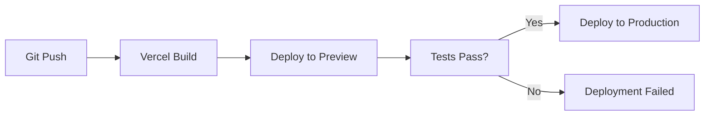

# Deployment Guide - Xploar.ai UPSC App

## 🚀 **Overview**

This guide covers deploying the Xploar.ai UPSC application to production using Vercel for frontend hosting and Supabase for backend services.

## 🏗️ **Architecture**

```
┌─────────────────┐    ┌─────────────────┐    ┌─────────────────┐
│   User Browser  │───▶│   Vercel CDN    │───▶│  Supabase API   │
│                 │    │   (Frontend)    │    │   (Backend)     │
└─────────────────┘    └─────────────────┘    └─────────────────┘
                              │
                              ▼
                       ┌─────────────────┐
                       │   GitHub Repo   │
                       │  (Version Ctrl) │
                       └─────────────────┘
```

## 📋 **Pre-Deployment Checklist**

### **✅ Code Quality**
- [ ] All components build without errors (`npm run build`)
- [ ] No console errors in browser
- [ ] Responsive design tested on multiple devices
- [ ] LocalStorage functionality working correctly
- [ ] All routes accessible and functional

### **✅ Environment Configuration**
- [ ] `.env.local` file created with production values
- [ ] Supabase credentials configured
- [ ] API endpoints updated for production
- [ ] Build scripts working correctly

### **✅ Testing**
- [ ] UPSC Phase 1 functionality tested
- [ ] UPSC Phase 2 functionality tested
- [ ] Waitlist modal working correctly
- [ ] Navigation between phases working
- [ ] Error handling implemented

## 🔧 **Vercel Deployment Setup**

### **1. Connect GitHub Repository**

1. **Go to [Vercel Dashboard](https://vercel.com/dashboard)**
2. **Click "New Project"**
3. **Import Git Repository**
4. **Select your GitHub repository**
5. **Configure project settings**

### **2. Project Configuration**

```json
// vercel.json (optional - Vercel auto-detects React)
{
  "buildCommand": "npm run build",
  "outputDirectory": "dist",
  "installCommand": "npm install",
  "framework": "vite"
}
```

### **3. Environment Variables**

**In Vercel Dashboard → Project Settings → Environment Variables:**

```bash
# Supabase Configuration
VITE_SUPABASE_URL=https://your-project.supabase.co
VITE_SUPABASE_ANON_KEY=your_anon_key_here

# App Configuration
VITE_APP_ENV=production
VITE_APP_URL=https://xploar.ai
```

### **4. Build Settings**

- **Framework Preset**: Vite
- **Build Command**: `npm run build`
- **Output Directory**: `dist`
- **Install Command**: `npm install`
- **Node.js Version**: 18.x (or higher)

## 🗄️ **Supabase Configuration**

### **1. Database Setup**

**Current Tables:**
```sql
-- Waitlist table (already exists)
CREATE TABLE IF NOT EXISTS waitlist (
  id UUID DEFAULT gen_random_uuid() PRIMARY KEY,
  name TEXT NOT NULL,
  email TEXT NOT NULL UNIQUE,
  created_at TIMESTAMP WITH TIME ZONE DEFAULT NOW()
);

-- Enable Row Level Security (RLS)
ALTER TABLE waitlist ENABLE ROW LEVEL SECURITY;

-- Create policy for waitlist
CREATE POLICY "Allow public waitlist insert" ON waitlist
  FOR INSERT WITH CHECK (true);
```

### **2. API Configuration**

**Row Level Security Policies:**
```sql
-- Allow anyone to join waitlist
CREATE POLICY "Public waitlist access" ON waitlist
  FOR ALL USING (true);

-- Future: Restrict user data access
-- CREATE POLICY "Users can only access their own data" ON user_progress
--   FOR ALL USING (auth.uid() = user_id);
```

### **3. Environment Variables**

**In Supabase Dashboard → Settings → API:**

```bash
# Project URL
https://your-project.supabase.co

# Anon Key (public)
eyJhbGciOiJIUzI1NiIsInR5cCI6IkpXVCJ9...

# Service Role Key (keep secret - for admin operations)
eyJhbGciOiJIUzI1NiIsInR5cCI6IkpXVCJ9...
```

## 🚀 **Deployment Process**

### **1. Initial Deployment**

```bash
# 1. Commit all changes
git add .
git commit -m "feat: prepare for production deployment"

# 2. Push to main branch
git push origin main

# 3. Vercel auto-deploys on push
# Check dashboard for deployment status
```

### **2. Verify Deployment**

**Check these URLs after deployment:**

- **Main Site**: `https://xploar.ai`
- **UPSC Phase 1**: `https://xploar.ai/upsc`
- **UPSC Phase 2**: `https://xploar.ai/upsc2`
- **Waitlist Modal**: Click "Join Waitlist" button

### **3. Post-Deployment Testing**

```bash
# Test all functionality on production
1. ✅ Homepage loads correctly
2. ✅ Navigation works (UPSC Prep link)
3. ✅ UPSC Phase 1 accessible and functional
4. ✅ UPSC Phase 2 accessible and functional
5. ✅ Waitlist modal shows UPSC features
6. ✅ "Try Demo" button redirects correctly
7. ✅ All localStorage functionality works
8. ✅ Responsive design on mobile/tablet
```

## 🔄 **Continuous Deployment**

### **1. Automatic Deployments**

**Vercel automatically deploys on:**
- ✅ Push to `main` branch → Production
- ✅ Push to any branch → Preview deployment
- ✅ Pull Request → Preview deployment

### **2. Deployment Workflow**



### **3. Branch Strategy**

```bash
main          # Production (auto-deploy)
├── develop   # Development (preview deploy)
├── feature/* # Feature branches (preview deploy)
└── hotfix/*  # Hotfix branches (preview deploy)
```

## 📊 **Monitoring & Analytics**

### **1. Vercel Analytics**

**Enable in Project Settings:**
- [ ] Web Analytics
- [ ] Performance Monitoring
- [ ] Error Tracking
- [ ] Real User Monitoring (RUM)

### **2. Supabase Monitoring**

**Dashboard Metrics:**
- [ ] Database performance
- [ ] API response times
- [ ] Error rates
- [ ] User activity

### **3. Custom Analytics**

**Consider adding:**
```javascript
// Google Analytics 4
// Hotjar for user behavior
// Sentry for error tracking
// Custom event tracking for UPSC features
```

## 🚨 **Troubleshooting**

### **Common Deployment Issues**

#### **1. Build Failures**
```bash
# Check build logs in Vercel dashboard
# Verify all dependencies are in package.json
# Check for syntax errors in components
# Ensure environment variables are set
```

#### **2. Environment Variable Issues**
```bash
# Verify .env variables in Vercel
# Check variable names (VITE_ prefix required)
# Ensure no typos in values
# Restart deployment after adding variables
```

#### **3. Routing Issues**
```bash
# Check App.jsx routing configuration
# Verify component imports
# Test routes locally before deployment
# Check for case sensitivity in file names
```

#### **4. Supabase Connection Issues**
```bash
# Verify URL and API key in Vercel
# Check Supabase project status
# Test API endpoints manually
# Verify CORS settings in Supabase
```

### **Debug Commands**

```bash
# Local build test
npm run build

# Check bundle size
npm run build -- --analyze

# Test production build locally
npm run preview

# Check for unused dependencies
npm audit
```

## 🔒 **Security Considerations**

### **1. Environment Variables**
- [ ] Never commit `.env` files to Git
- [ ] Use Vercel's environment variable system
- [ ] Rotate API keys regularly
- [ ] Limit API key permissions

### **2. Supabase Security**
- [ ] Enable Row Level Security (RLS)
- [ ] Create appropriate access policies
- [ ] Monitor API usage
- [ ] Regular security audits

### **3. Content Security Policy**
```html
<!-- Add to index.html if needed -->
<meta http-equiv="Content-Security-Policy" 
      content="default-src 'self'; 
               script-src 'self' 'unsafe-inline' 'unsafe-eval';
               style-src 'self' 'unsafe-inline';">
```

## 📈 **Performance Optimization**

### **1. Build Optimization**
```javascript
// vite.config.js
export default defineConfig({
  build: {
    rollupOptions: {
      output: {
        manualChunks: {
          vendor: ['react', 'react-dom'],
          upsc: ['./src/components/upsc'],
          ui: ['./src/components/ui']
        }
      }
    }
  }
});
```

### **2. Code Splitting**
```javascript
// Lazy load UPSC components
const XploarPhase1 = React.lazy(() => import('./components/upsc/XploarPhase1'));
const XploarPhase2 = React.lazy(() => import('./components/upsc/XploarPhase2'));
```

### **3. Caching Strategy**
```javascript
// Service Worker for offline functionality
// Browser caching for static assets
// CDN caching through Vercel
```

## 🔄 **Rollback Strategy**

### **1. Vercel Rollback**
```bash
# In Vercel dashboard:
1. Go to Deployments tab
2. Find previous successful deployment
3. Click "Promote to Production"
4. Verify functionality
```

### **2. Git Rollback**
```bash
# If needed, revert to previous commit
git revert HEAD
git push origin main

# Vercel will auto-deploy the reverted version
```

## 📚 **Post-Deployment Tasks**

### **1. Documentation Updates**
- [ ] Update README with production URLs
- [ ] Document any production-specific configurations
- [ ] Update deployment guide with lessons learned
- [ ] Create runbook for common issues

### **2. Team Communication**
- [ ] Notify team of successful deployment
- [ ] Share production URLs
- [ ] Document any configuration changes
- [ ] Schedule post-deployment review

### **3. Monitoring Setup**
- [ ] Set up uptime monitoring
- [ ] Configure error alerting
- [ ] Set up performance monitoring
- [ ] Create monitoring dashboards

---

**Document Version**: 1.0.0
**Last Updated**: December 2024
**Next Review**: After first production deployment
**Maintainer**: DevOps Team
